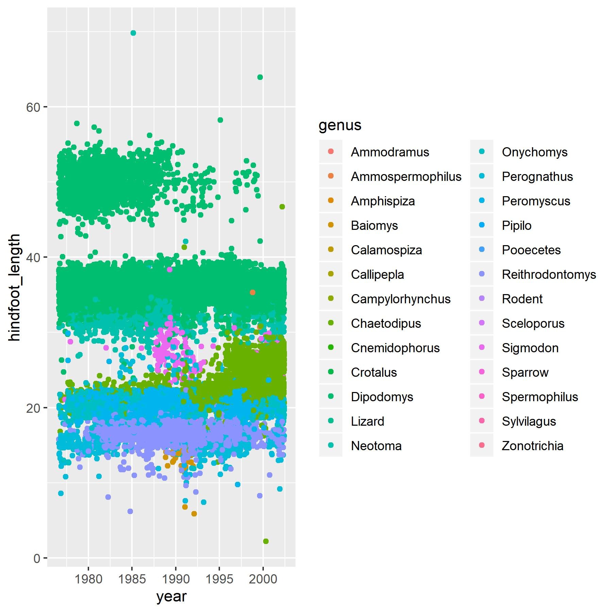

# This is a big header

## This is a smaller header

This is just some regular text. Or some **bold** text. 

```{r, message = FALSE}
library(tidyverse)
```


Alright, we loaded tidyverse, let's look at some data. 

```{r}
summary(storms)
str(storms)
```


Let's try making a plot

```{r, echo = FALSE}
# this hides the code but shows the output! (echo = FALSE)

storms %>% 
  ggplot(aes(x = as.factor(month), y = pressure, color = wind)) + 
  geom_jitter(alpha = 0.5)

```


To include a web link:

[Link to the RMarkdown lesson](https://gge-ucd.github.io/R-DAVIS/resources.html)


To include an image that is not generated by my code: 



the ../ is read as "go up one level in your directory level"


```{r}
library(knitr)
kable(storms[1:20,], caption = "table made with kable")
```


```{r}
htmlTable::htmlTable(storms[1:20,])
```

This one makes an interactive table

```{r}
DT::datatable(storms)
```

